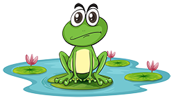
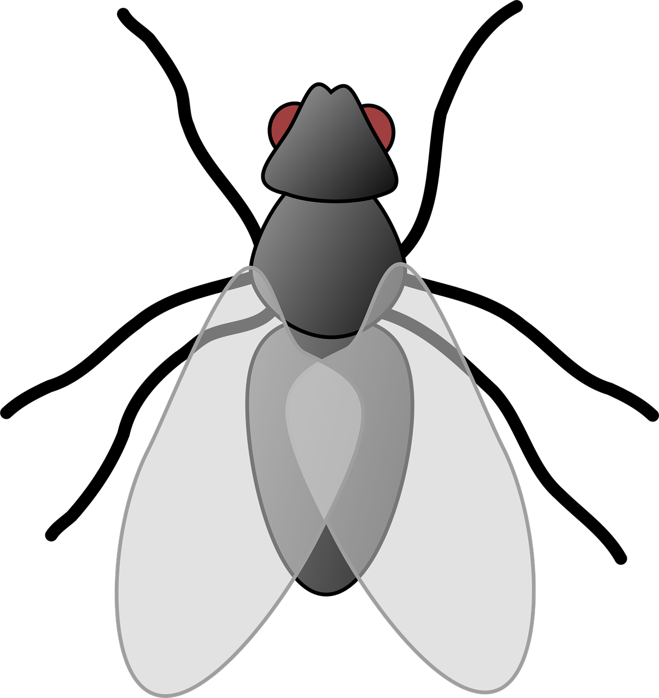

 Froginswamp

Ima Williams

# Description
This is a game about catching flies and trying to stay alive. The game starts simple with a frog trying to catch flies. However the challenge starts after the frog catches 5 flies. An intrusive bumblebee comes in and disrupt the frog. The bumblebee moves at random and is able to eat catch the flies. There is no way to get rid of the bumblebee, touching it will make the frog sick. The frog is can only eat what is not a fly three times before the game ends and it dies. The fun does not stop there, the sky changes from day time to night time. When the sky becomes dark the bumblebee goes to rest and a wild bat swoops in to cause trouble. There is no simple or easy way for the frog to eat its meal. The same concept applies to the bat, as eating it 3 times will cause the game to end. The only why to hang on and save yourself is to eat as many flies as you can. Eating flies will allow the frog to heal and regain it's strength.

Functions of the game
The frog can move left and right by moving the left and the right keys.
The bumblebee starts off as inactive for the first 5 flies. After eating 5 flies it will come in and problem when a the frog eats it instead of the fly. The bumblebee will move at random and will stay within the screen. It will restart if it reaches any of the extremes. 
The bumblebee can also eat the flies. Eating the flies will can them to reset at random
Eating the bumblebee will slowly turn the frog black. At the same time if the bumblebee also touches the frog, the frog will slowly turn black.
The background changes from day to night with the sky getting dark enough to turn to night time.
Once the sky becomes dark the bumblebee is no longer active and the hidden bat will become active. The bat swoops in with great speed and can also eat flies. 
Eating or touching the bat wil cause the frog to change color before it completely croaks for good.
Eating flies is the only slavation as it can revert the frog back to normal.
Staying alive is the most important aspect for the frog.

# Attributes

The game is a modification from Prof.Pippin Baar game. The base of the game was created by the professor.

Images

https://www.vecteezy.com/

All images came fro vecteezy.com from various different artist. 

-For this project I have learned how to use active by talking with Prof. Pippin Baar, which has allowed me to make the bumblebee and the bat active at different stages of the game.
-Bezier is a function that was learned from p5js.org in order to create the grass.

A game about catching flies.

[Play it!](https://pippinbarr.github.io/cart253-examples/topics/making/frogfrogfrog/index.html)

- [Ideas](./ideas.md)
- [Planning](./planning.md)
- [Pseudocode](./pseudocode.md)

## License

The p5.js library is free software; you can redistribute it and/or modify it under the terms of the GNU Lesser General Public License as published by the Free Software Foundation, version 2.1.

p5.js is currently led by Qianqian Ye and created by Lauren Lee McCarthy. The p5.js library and this website were developed by p5.js Contributors and the Processing Foundation

Vecteezy licensing

This Vecteezy License Agreement (“License Agreement”) constitutes a legally binding agreement made between you, whether personally or on behalf of an entity (“you” or “Licensee”), and Eezy LLC or any Eezy brands, including the Vecteezy brand (“Vecteezy”) (“we,” “us,” or “our”), concerning your access to and use of the https://www.vecteezy.com/ website as well as any other media form, media channel, mobile website, or mobile application related, linked, or otherwise connected thereto (collectively, “the Vecteezy Site”). This License Agreement states the rights and obligations regarding the digital content (“Content”) licensed by you through your use of the Vecteezy Site. This License Agreement supplements the Terms of Use posted on the Vecteezy Site, as well as any other provisions posted on the Vecteezy Site, all of which are incorporated in this License Agreement. You acknowledge that you have read, understand and accept the Terms of Use.
